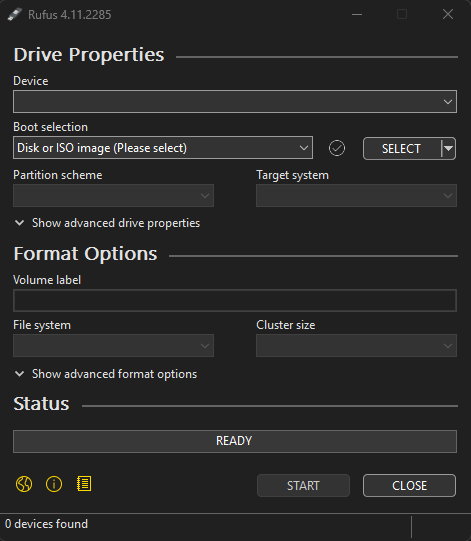
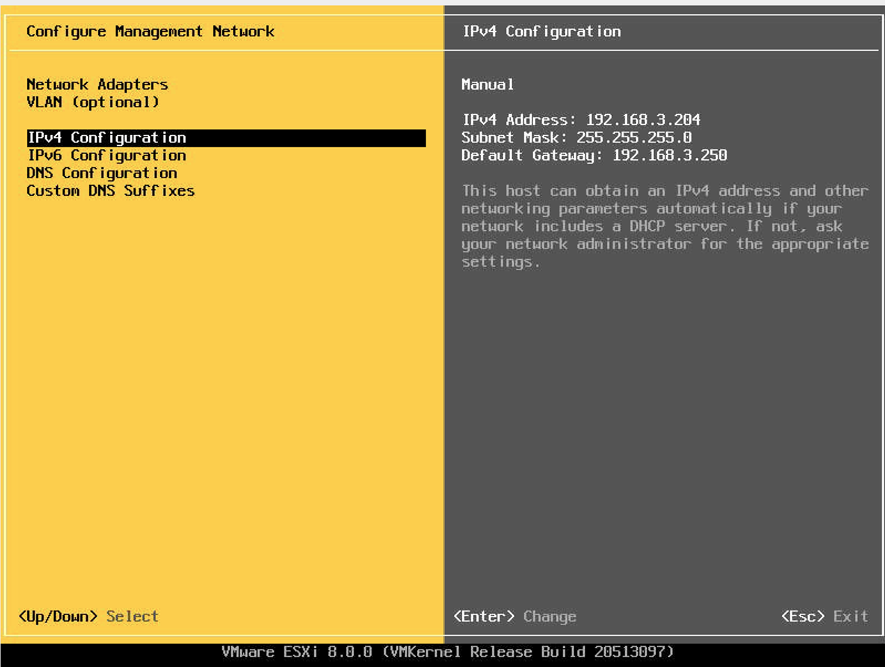
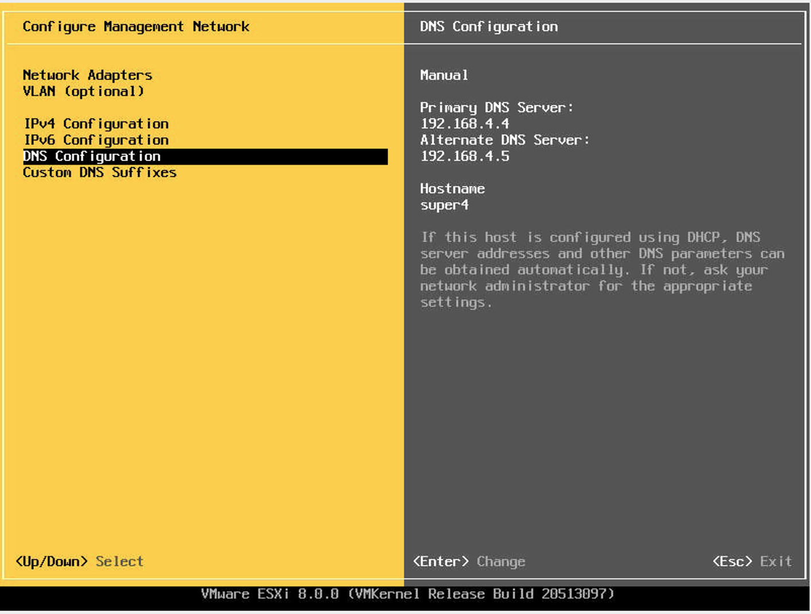
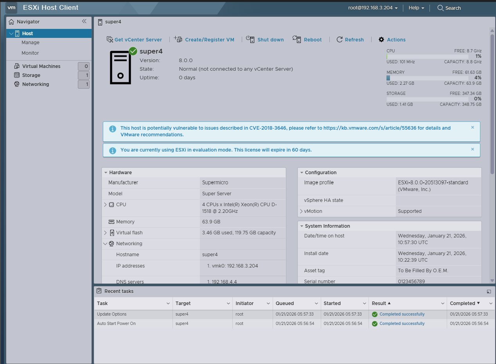
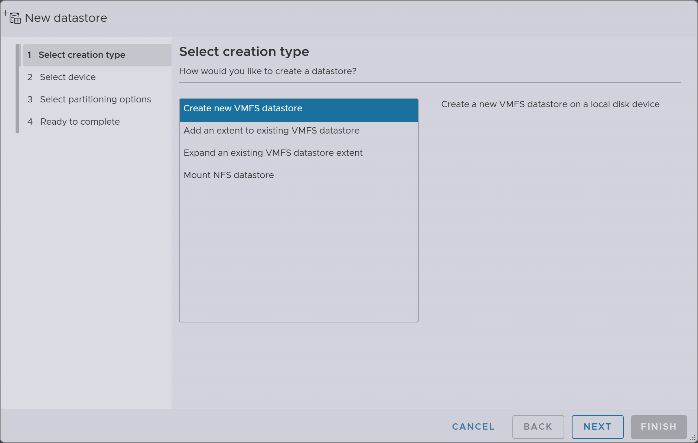

# Milestone 1

Milestone 1 is initial set-up of our server, and our firewall and managment vm. I will be adding most of the images later as most of them are not on my local machine, so this may look a little sparse until then.

## Prerequisites

1. A USB drive,preferably over 8 gigabytes in size
   1. This will be **wiped clean**, so transfer any data you would like to keep.
2. An already working computer that has a USB port and network connectivity with admin permissions
3. An ESXI .iso file
4. A server/computer that you want to run ESXI on

## Boot media

First, download a program that can format bootable media. In our case we used a utility named [RUFUS](https://rufus.ie/en/). Rufus can be aquired  either from the web or the microsoft store.  Rufus is a program that helps create and format bootable USB drives. *This is where you need admin privlages as rufus needs them to run.*

When opened rufus presents the window below. The Device input is for the drive that is being formated into a boot drive, **make sure this is not a drive you care about, it will be wiped clean.** In our case boot selection does not change as we had an ESXI .iso file provided, how to aquire one can be found [here](https://knowledge.broadcom.com/external/article/372545/download-esxi-patch-and-the-isos-for-lat.html).

The select drop down opens the file browser, an issue that was found and addressed was that the ISO was not showing in the file browser opened by Rufus. To remedy this open the file browser in a different window and navigate to the folder where the ISO is located, then click and drag the .iso file onto the Rufus window.

In our instance all other configuration options were left blank. After all previous steps were completed click the start button, this will take some time, when it is finished the **READY** bar at the bottom will be green. Do not hit the start button again.

If no issues arose the boot media should be properly formatted. Insert the created boot media in the appropriate port on the host machine.

## Installing VMware ESXi

Once the boot media is inserted either power on or power cycle the host system. If there were no issues you should be brought to the installer. **When propmted for a password do not forget it if you do you will need to restart.**

In our case the first thing that we set up was the network this is done by hitting f2 and navigatging with the arrow keys to the network managegment menu. In this menu we configured the  proper network adapter at the the top of the page. VLANS were not configured at this time.

Ipv4 was configured with our given Ip addresses a /24 subnet and the room default gateway, as seen above. Ipv6 was disabled as it is not required. DNS was configured as in the image below. As per the network diagram

The DNS servers used are the two cyber.local servers, because of this we can not access them for configuration. DNS configuration is also where we change the host name of the server in my case it is server 4, as that was what was assigned to me, your's will most likely be different.

## Accessing and configuring ESXi host

After a management ip is set and you are able to connect to it direct a web browser to the ip address. Use the login that you were propmpted to create when setting up the server, usually the username is root. After login the homepage will resemble the image below.

## Storage

When opening the storage tab it will look similar to the image below. Your server will have one data store, the drive that you placed the operating system on adding a new one is very easy.

Click on the create new data store in the top right of the largest window. The window below will pop up, in our case we want to create a new VMFS datastore. Follow the steps presented in the window with the formatting and specifications required for your system.

### .ISOs

In most cases you will need to upload various .iso files to create your vms. For simplicity and ease of access we create a folder named ISOs to store all future .ISO files in. To do this click on the create directory button in the top right of the menu bar, type in the name of the folder then click create. To upload an .ISO click the upload button in the top left of the menu bar, then when the file browser opens upload all files that you would like to add.

## Networking

### Useful links

* [BROADCOM-Installing ESXi on a supported USB flash drive or SD flash card](https://knowledge.broadcom.com/external/article?legacyId=2004784)
* [NVIDIA-Installing VMware ESXI](https://docs.nvidia.com/ai-enterprise/deployment/vmware/latest/installing-esxi.html)
* [BROADCOM-Download latest ISOs and patches for vSphere ESXI](https://knowledge.broadcom.com/external/article/372545/download-esxi-patch-and-the-isos-for-lat.html)
