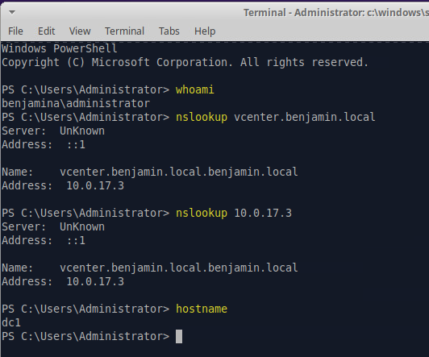

# Active Directory Install

### 1.Install the AD Domain Services Role

First, you need to tell Windows that this server is intended to be a Domain Controller. Open PowerShell as an Administrator and run: `Install-WindowsFeature -Name AD-Domain-Services -IncludeManagementTools`

### 2. Create the New Forest

Once the bits are installed, you run the command to actually configure the forest. This command will prompt you to enter a Safe Mode Administrator Password (DSRM)—don't lose this! You'll need it if the database ever gets corrupted.

Run this command to start the promotion:

Install-ADDSForest `-DomainName "benjamin.local"` -DomainNetbiosName "BENJAMINA" `-InstallDns:$true` -Force:$true

### 3. Verify the Installation

Before you start adding users, make sure the foundation is solid. Run this command to check if the Domain Controller (DC) is advertising itself properly:`Get-Service adws, dns, netlogon, kdc | Select-Object DisplayName, Status`*All four services should show as **Running** .*

### 4. Create the Reverse Lookup Zone

The command to create a reverse lookup zone is as follows: `Add-DnsServerPrimaryZone -NetworkId "10.0.17.0/24" -ReplicationScope Forest`

### 5. Creating A and PTR records

```
vcenter

Add-DnsServerResourceRecordA -Name "vcenter" -ZoneName "benjamin.local" -IPv4Address "10.0.17.3" -CreatePtr

480-fw

Add-DnsServerResourceRecordA -Name "480-fw" -ZoneName "benjamin.local" -IPv4Address "10.0.17.2" -CreatePtr

xubuntu-wan

Add-DnsServerResourceRecordA -Name "xubuntu-wan" -ZoneName "benjamin.local" -IPv4Address "10.0.17.100" -CreatePtr
```

### DC1 ptr record

Since dc1 is our domain controller it already has an 'a record' it needs a ptr record to accompany the command is below.

`Add-DnsServerResourceRecordPtr -Name "4" -ZoneName "17.0.10.in-addr.arpa" -PtrDomainName "dc1.benjamin.local"`

#### Testing

To test if our records are actually working properly we can test on two separate systems, dc1 and mgmt. While in remoted into the dc1 run the commands `nslookup vcenter.benjamin.local` and `nslookup 10.0.17.3`. you can also run the commands on your mgmt system after you reconfigure the netplan file to point your search domains towards dc1.

dc1 nslookup through xubuntu ssh



# Dhcp

#### Install

The install is the same as adding ad-ds, change the adds in the command to DHCP and hit enter.
`Install-WindowsFeature -Name DHCP -IncludeManagementTools`

#### Authorization

Because this is an Active Directory environment, a DHCP server won't hand out IPs until it is "authorized." This prevents rogue DHCP servers from messing up your network.

```
# Add the DHCP security groups
netsh dhcp add securitygroups

# Restart the service to apply group changes
Restart-Service dhcpserver

# Authorize the server in AD 
Add-DhcpServerInDC -DnsName "dc1.benjamin.local" -IPAddress 10.0.17.4
```

#### Scope

The Scope defines which IPs are available for lease. The lab instructions tell us to create a range of 10.0.17.101-150, this is to avoid conflict with any of our establised addresses, and to allow expansion for many new ones.
`Add-DhcpServerv4Scope -Name "domain"  -StartRange 10.0.17.101 -EndRange 10.0.17.200 -SubnetMask 255.255.255.0 -State Active`

The commands below are for setting the dhcp default gateway, dns server and our domain name

##### default gateway

`Set-DhcpServerv4OptionValue -ScopeId 10.0.17.0 -OptionId 3 -Value 10.0.17.2`

##### dns server

`Set-DhcpServerv4OptionValue -ScopeId 10.0.17.0 -OptionId 6 -Value 10.0.17.4`

##### domain name

`Set-DhcpServerv4OptionValue -ScopeId 10.0.17.0 -OptionId 15 -Value "benjamin.local"`

#### Testing

To test this you can run the windows commands `ipconfig /release` `ipconfig /renew` `ipconfig /all` on a device that is connected to the same "network" as the server. On linux the commands are `sudo dhclient -r` `sudo dhclient` ip a

# Remote Desktop

First run the command below, make sure there are no spelling mistakes, **it will not tell you**
`Set-ItemProperty -Path 'HKLM:\System\CurrentControlSet\Control\Terminal Server' -Name "fDenyTSConnections" -Value 0`
Next run the command `Enable-NetFirewallRule -DisplayGroup "Remote Desktop"` to enable the ports associated with remote desktop

### User Creation

To create a user run the command `net user [username] [password] /add /domain To then give the user domain admin permissions run the command `net group "domain admins" [username] /add /domain`. To see if this worked run the command `net user`and`net group`
