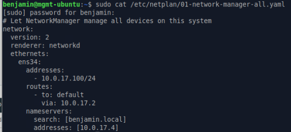
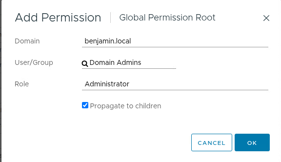

# Domain Joining

Before any steps are taken to configure Vcenter Single sign on you need to point your management serve at the domain controller that was made in the last lab. My GUI configuration did not work so my netplan is as [below](../../Network-configuration/00-netplan.yaml).

While this is not a true domain join, for our case its good enough for right now as our management box points to our domain controller.

# Adding domain to SSO providers

Adding our domain to the SSO providers is hidden in many layers of menus, with the combination of the instructions being somewhat misleading.

Login to your vsphere client *(this is 10.0.17.3 not with the 5480 port)* under your administrator account, this should be administrator@vsphere.local and the password that you created. Next click the hamburger menu button in the top left, then single sign on configuration, next active directory domain, and finally join AD. Once here enter in the username and password of your domain admin account.

### Permissions

** If you try to login at this point you may notice that it does not work yet, and gives you an error along the lines of "you do not have access to sign in" **

To fix the above issue go into the global permissions menu at the top of the screen, click add, click on the domain value and change that to your created domain. Next type in Domain Admins, keep the role as administrator, do not forget to click propogate to children. This should resolve the issue of not being able to sign in under domain users.

