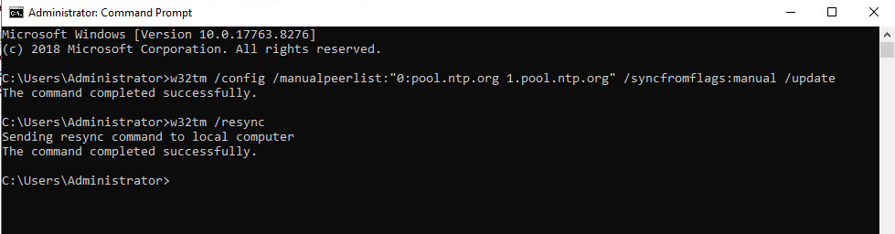
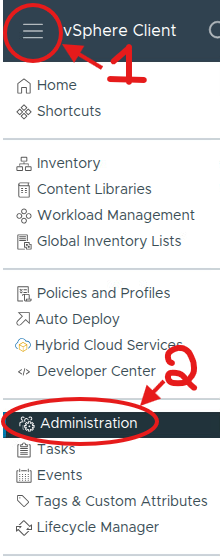
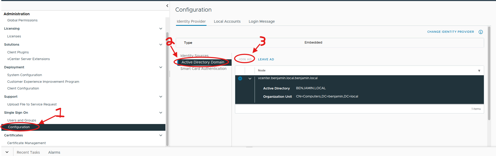
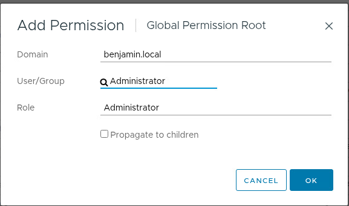
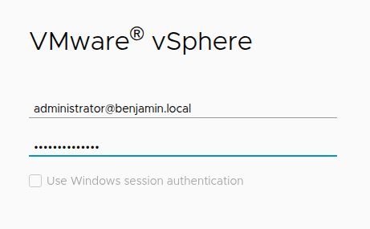

#### Connecting to NTP servers

Enter your domain controller machine for us its on dc1 windows server, enter an elevated command terminal and enter the following commands.

`/config /manualpeerlist:"0:pool.ntp.org 1.pool.ntp.org" /syncfromflags:manual /update`

`w32tm /resync`

### Connecting Vsphere to our active directory domain

To enable single sign on log into vsphere under the default admin account administrator@vshpere.local. After the sign in click on the hamburger menu on the top right then administraton.

This will bring you to the screen below. First click on configuration, then active directory domain, finally click add then sign into your active directory administrator account. This changes your vshperes identity provider

Next go to administraton access control global permissions click on add. For the domain add your created domain for user/group I would add administrator with the administrator role. Make sure to click the propagate to children checkbox so that all users in the administrator group become admins as well.

To test if your domain is properly joined sign out and sign back in with one of your windows domain accounts, pefereably one under the administrators group.

When logged in as your new account you should see your domain.local instead of vsphere.local if everything is done correctly, if not you may not be able to sign in under your domain accounts.

