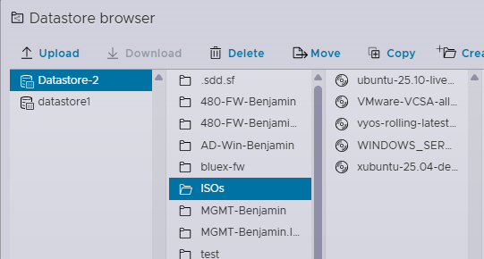
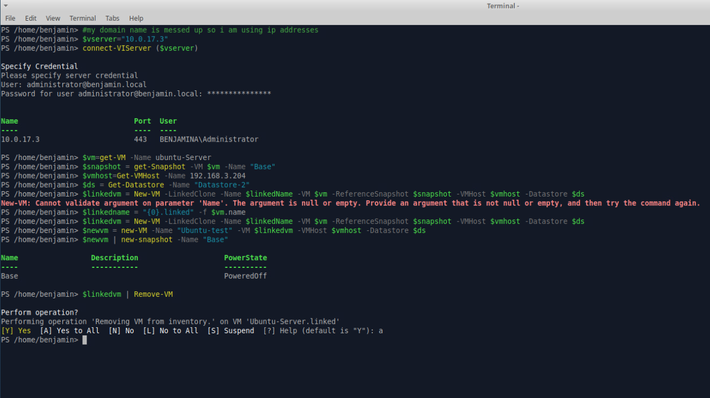
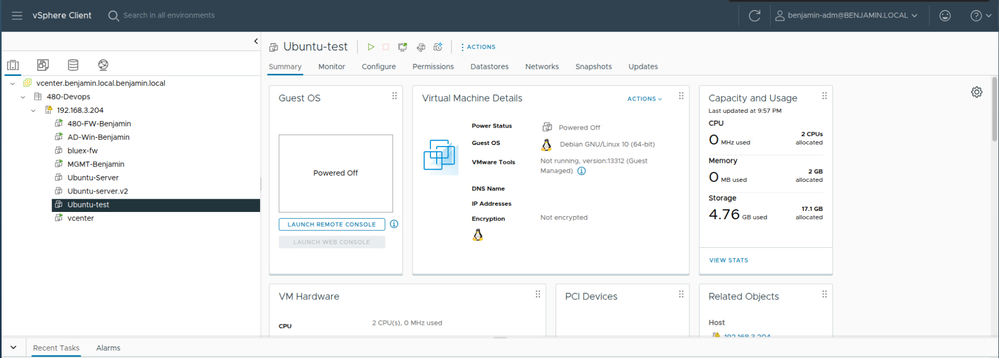
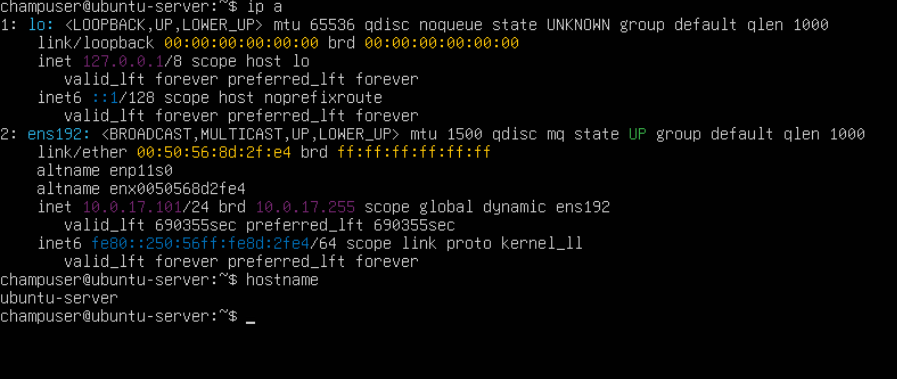
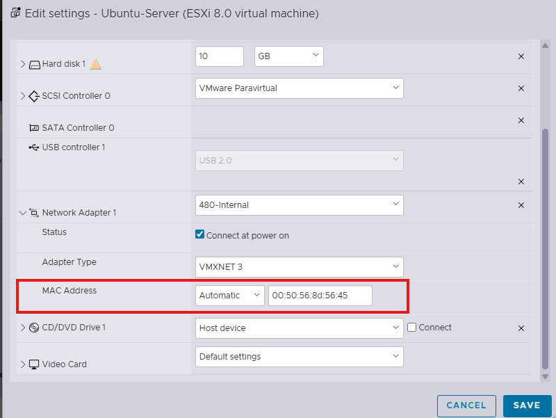

### Prerequisites

Install all the dependencies for PowerCLI and Ansible using this [guide](https://greenmountaincyber.com/docs/topics/vmware/powercli/xubuntu-dependencies).

Long story short: `sudo apt update` `sudo apt install ansible` `sudo snap install powershell --clasic` *There are more commands in the guide* 

We will be following [this guide](https://greenmountaincyber.com/docs/topics/vmware/powercli/extracting-snapshots/https:/) for this lab, for the most part this guide will be following that.

Make sure that you have all of the ISOs downloaded from the shared drive before starting as they take awhile to download, if you havent already put them in a folder for easier navigation.

### Start of Lab content

This is a screenshot of the commands running to create a new vm linked from the Ubuntu server vm to create a new vm named Ubuntu-test.

If everything went correctly you should see your create VM in the either home page of vshpere or esxi.

Starting up the new vm and running `ip a` should get you an IP address due to our DHCP server on windows.

## Troubleshooting

One of the issues that I ran into was getting the newly created clones to pull from dhcp, I suspect this is because clones have the same MAC addresses as their parent. The way that I chose to fix this is to install dhclient `sudo apt install isc-dhcp-client`on the parent system as well as change the the assigned MAC address in vshpere to automatic under the network adapter settings*all on the parent system*. **As of now I do not know if this breaks anything so do this with caution**

